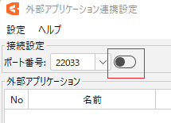
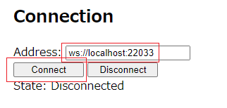
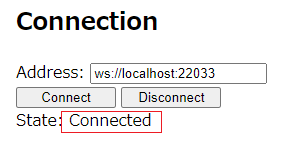
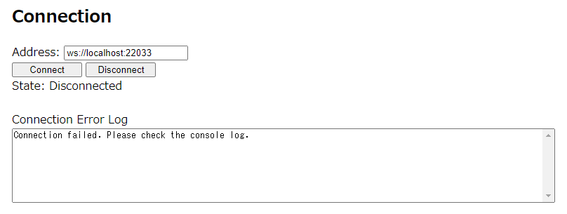
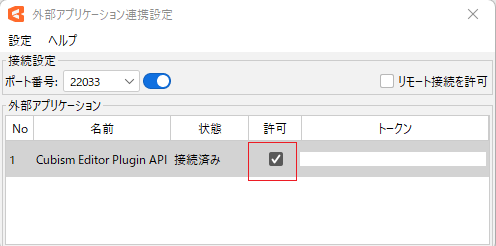
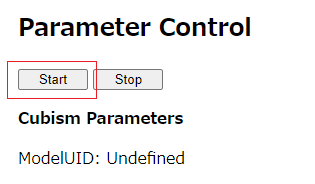
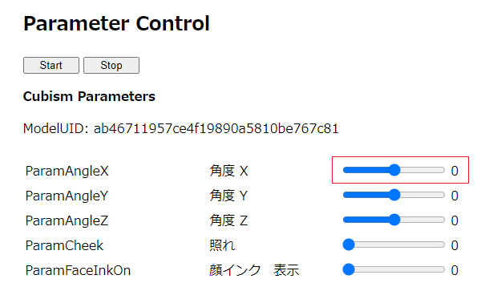

# 01_ParameterControl
Cubism Editorに接続し、対象のモデルのパラメータを操作することができます。  
https://live2d-garage.github.io/CubismExternalAppPluginSamples/01_ParameterControl/index.html  
  
#### 注意  
セキュリティの面から、HTMLのサンプルをダウンロードして実行した場合は、HTMLを読み込み(または再読み込み)するごとにエディタで許可を与える必要があります。  
  
### 利用手順  
1. Cubism Editorを起動します。  
2. ファイルメニューから任意のモデルを開きます。  
3. ファイルメニューの「外部アプリケーション連携設定」を選択し、ダイアログを開きます。  
4. 外部アプリケーション連携設定ダイアログからポート番号を設定し、トグルスイッチをクリックして外部連携を有効化します。  
  
5. サンプルHTMLを起動します。  
https://live2d-garage.github.io/CubismExternalAppPluginSamples/01_ParameterControl/index.html  
6. 「Address」に接続先を設定し、「Connect」をクリックします。  
  
   - 接続されると「State」が「Connected」になります。  
  
   - 接続に失敗すると、「Connection Error Log」にメッセージが表示されます。  
(接続先設定が間違っているとき、Cubism Editor側の外部連携を有効化していないとき等)  
  
7. Cubism Editorの外部アプリケーション連携設定ダイアログの接続したアプリケーションの「許可」のチェックボックスにチェックを入れます。  
これを実施することで、外部アプリケーション連携をすることができます。  
  
8. Parameter Controlの「Start」をクリックします。  
  
   - Cubism Parameters以下にパラメータ名とスライダー、数値が表示されます。  
スライダーを操作することで、パラメータ値を変更することができ、モデルに反映されます。  
  
  
***
You can connect to Cubism Editor and manipulate the parameters of the target model.  
https://live2d-garage.github.io/CubismExternalAppPluginSamples/01_ParameterControl/index.html  
  
#### Caution  
For security reasons, if you download and run the HTML sample, you will need to approve in the editor each time you load (or reload) the HTML-page.  
  
### Instructions for use  
1. Start Cubism Editor.  
2. Open any model from the file menu.  
3. Select "External Application Integration settings" from the file menu to open the dialog.  
4. Set the port number from the external application linkage settings dialog and click the toggle switch to enable external linkage.  
  
5. Start sample HTML.  
https://live2d-garage.github.io/CubismExternalAppPluginSamples/01_ParameterControl/index.html  
6. Set the connection destination in "Address" and click "Connect".  
  
   - Once connected, “State” becomes “Connected”.  
  
   - If the connection fails, a message is displayed in the Connection Error Log.  
(When the connection destination settings are incorrect, when external linkage on the Cubism Editor side is not enabled, etc.)  
  
7. Check the "Permission" checkbox for the connected application in the external application linkage settings dialog of Cubism Editor.  
By implementing this, it is possible to link with external applications.  
  
8. Click "Start" in Parameter Control.  
  
   - The parameter name, slider, and numerical value are displayed under Cubism Parameters.  
By operating the slider, you can change the parameter value and it will be reflected in the model.  
  
