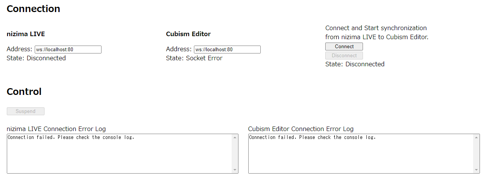

# 02_nizimaLIVEBridge  
### nizima LIVE Bridge (nizima LIVE -> Cubism Editor)  
https://live2d-garage.github.io/CubismExternalAppPluginSamples/02_nizimaLIVEBridge/index_from_nizimaLIVE_to_CubismEditor.html  
上記のサンプルはnizima LIVEとCubism Editorに接続し、nizima LIVEからCubism Editorへのパラメータの同期を行います。  
nizima LIVEにて表現した表情や動作、カメラキャプチャによる動きを、Cubism Editorのモデルへ反映します。  
  
### nizima LIVE Bridge (Cubism Editor -> nizima LIVE)  
https://live2d-garage.github.io/CubismExternalAppPluginSamples/02_nizimaLIVEBridge/index_from_CubismEditor_to_nizimaLIVE.html  
上記のサンプルはnizima LIVEとCubism Editorに接続し、Cubism Editorからnizima LIVEへのパラメータの同期を行います。  
Cubism Editorにてパラメータを調整し、表現した表情や動作を、nizima LIVEのモデルへ反映します。  
  
#### 注意  
セキュリティの面から、HTMLのサンプルをダウンロードして実行した場合は、HTMLを読み込み（または再読み込み）するごとにエディタで許可を与える必要があります。  
  
### 利用手順  
1. Cubism Editorを起動する。  
2. ファイルメニューから任意のモデルを開く。  
(nizima LIVEと連携するため、連携するモデルを開くこと。)  
3. ファイルメニューの「外部アプリケーション連携設定」を選択し、ダイアログを開く。  
4. 外部アプリケーション連携設定ダイアログからポート番号を設定し、三角ボタンをクリックして外部連携を有効化。  
  
5. nizima LIVEを起動する。  
6. モデル一覧から任意のモデルを選択する。  
(Cubism Editorと連携するため、連携するモデルを選択すること。)  
7. 設定・その他から「プラグイン」を選択し、ダイアログを開く。  
8. プラグインマネージャーからポート番号を設定し、トグルスイッチをクリックして外部連携を有効化。  
  
9. サンプルHTMLを起動。  
以下はnizima LIVEからCubism Editorへパラメータの同期を行う場合、  
https://live2d-garage.github.io/CubismExternalAppPluginSamples/02_nizimaLIVEBridge/index_from_nizimaLIVE_to_CubismEditor.html  
以下はCubism Editorからnizima LIVEへパラメータの同期を行う場合、  
https://live2d-garage.github.io/CubismExternalAppPluginSamples/02_nizimaLIVEBridge/index_from_CubismEditor_to_nizimaLIVE.html  
10. nizima LIVEとCubism Editorの各「Address」に接続先を設定し、「Connect」をクリック。  
  
    - 接続に失敗すると、各「Connection Error Log」にメッセージが表示される。  
(接続先設定が間違っているとき、Cubism Editor側の外部連携を有効化していないとき等)  
  
11. nizima LIVEのプラグインマネージャーに表示された外部連携先のトグルスイッチをクリックして外部連携を許可する。  
  
    - 許可するとHTML側のnizima LIVEの「State」が「Connected」になる。  
  
12. HTML側のCubism Editorの「State」が「Connected」になっていることを確認し、  
Cubism Editorの外部アプリケーション連携設定ダイアログの接続したアプリケーションの「許可」のチェックボックスにチェックを入れる。  
  
13. 12を実施したタイミング「State」が「Connected And Sync」になり、パラメータの同期を開始する。  
同期を止めるには「Disconnect」をクリックする。クリックすると同期停止とnizima LIVEとCubism Editorとの接続が解除される。  
  
パラメータの同期を開始すると以下のようなパラメータ名とスライダー、数値が表示されるが、スライダーは操作できない。  
あくまでパラメータの値の変化がモデル以外で視覚的に変化していることを示すためのもの。  
  
  
***
### nizima LIVE Bridge (nizima LIVE -> Cubism Editor)  
https://live2d-garage.github.io/CubismExternalAppPluginSamples/02_nizimaLIVEBridge/index_from_nizimaLIVE_to_CubismEditor.html  
The above sample connects nizima LIVE and Cubism Editor and synchronizes parameters from nizima LIVE to Cubism Editor.  
The facial expressions and movements expressed in nizima LIVE, as well as the movements captured by the camera, will be reflected in the Cubism Editor model.  
  
### nizima LIVE Bridge (Cubism Editor -> nizima LIVE)  
https://live2d-garage.github.io/CubismExternalAppPluginSamples/02_nizimaLIVEBridge/index_from_CubismEditor_to_nizimaLIVE.html  
The above sample connects nizima LIVE and Cubism Editor and synchronizes parameters from Cubism Editor to nizima LIVE.  
Adjust the parameters in Cubism Editor and reflect the expressed expressions and movements on the nizima LIVE model.  
  
#### Caution  
For security reasons, if you download and run the HTML sample, you will need to approve in the editor each time you load (or reload) the HTML-page.  
  
### Instructions for use  
1. Start Cubism Editor.  
2. Open any model from the file menu.  
(To link with nizima LIVE, open the model to be linked.)  
3. Select "External Application Integration settings" from the file menu to open the dialog.  
4. Set the port number from the external application linkage settings dialog and click the triangle button to enable external linkage.  
  
5. Start nizima LIVE.  
6. Select any model from the model list.  
(In order to link with Cubism Editor, select the model to be linked.)  
7. Select "Plug-in" from Settings/Other to open the dialog.  
8. Set the port number from the Plug-in Manager and click the toggle switch to enable external integration.  
  
9. Start sample HTML.  
The following is when synchronizing parameters from nizima LIVE to Cubism Editor,  
https://live2d-garage.github.io/CubismExternalAppPluginSamples/02_nizimaLIVEBridge/index_from_nizimaLIVE_to_CubismEditor.html  
The following is when synchronizing parameters from Cubism Editor to nizima LIVE,  
https://live2d-garage.github.io/CubismExternalAppPluginSamples/02_nizimaLIVEBridge/index_from_CubismEditor_to_nizimaLIVE.html  
10. Set the connection destination for each "Address" of nizima LIVE and Cubism Editor and click "Connect".  
  
    - If a connection fails, a message will be displayed in each Connection Error Log.  
(When the connection destination settings are incorrect, when external linkage on the Cubism Editor side is not enabled, etc.)  
  
11. Click the toggle switch for the external link displayed in nizima LIVE's Plug-in Manager to allow external link.  
  
    - If you allow it, the "State" of nizima LIVE on the HTML side will become "Connected".  
  
12. Confirm that "State" of Cubism Editor on the HTML side is "Connected",  
Check the "Permission" checkbox for the connected application in the external application linkage settings dialog of Cubism Editor.  
  
13. When step 12 is performed, the “State” changes to “Connected And Sync” and synchronization of parameters starts.  
Click "Disconnect" to stop synchronization. Clicking this will stop synchronization and disconnect the connection between nizima LIVE and Cubism Editor.  
  
When you start synchronizing parameters, the parameter name, slider, and numerical value as shown below are displayed, but the slider cannot be operated.  
This is just to show that the change in parameter value is visually changing outside of the model.  
  
