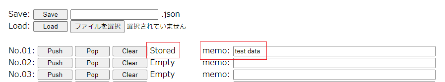
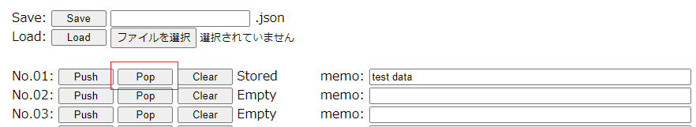
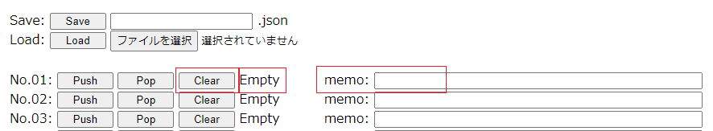
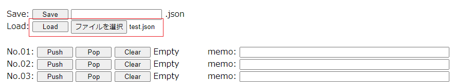

# 03_ParameterComp
Cubism Editorに接続し、対象のモデルの現在のパラメータを一時記憶、復元することができます。  
https://live2d-garage.github.io/CubismExternalAppPluginSamples/03_ParameterComp/index.html  
  
#### 注意  
セキュリティの面から、HTMLのサンプルをダウンロードして実行した場合は、HTMLを読み込み(または再読み込み)するごとにエディタで許可を与える必要があります。  
  
### 利用手順  
1. Cubism Editorを起動します。  
2. ファイルメニューから任意のモデルを開きます。  
3. ファイルメニューの「外部アプリケーション連携設定」を選択し、ダイアログを開きます。  
4. 外部アプリケーション連携設定ダイアログからポート番号を設定し、トグルスイッチをクリックして外部連携を有効化します。  
  
5. サンプルHTMLを起動します。  
https://live2d-garage.github.io/CubismExternalAppPluginSamples/03_ParameterComp/index.html  
6. 「Address」に接続先を設定し、「Connect」をクリックします。  
  
   - 接続されると「State」が「Connected」になります。  
  
   - 接続に失敗すると、「Connection Error Log」にメッセージが表示されます。  
(接続先設定が間違っているとき、Cubism Editor側の外部連携を有効化していないとき等)  
  
7. Cubism Editorの外部アプリケーション連携設定ダイアログの接続したアプリケーションの「許可」のチェックボックスにチェックを入れます。  
これを実施することで、外部アプリケーション連携をすることができます。  
  
8. Cubism Editorにてパラメータを調整して、一時記憶したい値にします。  
9. SlotsのNo.01の「Push」をクリックすることで、パラメータ値を一時記憶できます。  
  
   - パラメータ値が保存されると「Stored」と表示されます。  
「memo」に保存したパラメータ値がどのような情報かをメモすることができます。  
  
   - パラメータ値が保存されると同時に記憶したパラメータ値の一覧が表示されます。  
  
10. Cubism Editorにてパラメータを変更した後で、No.01の「Pop」をクリックすることで、一時記憶したパラメータ値を復元できます。  
  
    - パラメータ値が復元されると同時に復元したパラメータ値の一覧が表示されます。  
  
11. 一時記憶したパラメータ値を削除したい場合は、No.01の「Clear」をクリックします。  
削除されると「Empty」と表示されます。同時に「memo」も削除されます。  
  
    - 一時記憶、復元はNo.01からNo.16まで16個分一時記憶、復元できます。  
12. ファイル名を指定して「Save」をクリックすることで、一時記憶したパラメータ値とメモををJSONファイルに保存することができます。  
  
13. JSONファイルを指定して「Load」をクリックすることで、JSONファイルに保存したパラメータ値とメモを読み込むことができます。  
  
    - 読み込みに指定するJSONファイルは基本的にこのサンプルの「Save」から保存したファイルを使用してください。  
  
***
You can connect to Cubism Editor and temporarily store and restore the current parameters of the target model.  
https://live2d-garage.github.io/CubismExternalAppPluginSamples/03_ParameterComp/index.html  
  
#### Caution  
For security reasons, if you download and run the HTML sample, you will need to approve in the editor each time you load (or reload) the HTML-page.  
  
### Instructions for use  
1. Start Cubism Editor.  
2. Open any model from the file menu.  
3. Select "External Application Integration settings" from the file menu to open the dialog.  
4. Set the port number from the external application linkage settings dialog and click the toggle switch to enable external linkage.  
  
5. Start sample HTML.  
https://live2d-garage.github.io/CubismExternalAppPluginSamples/03_ParameterComp/index.html  
6. Set the connection destination in "Address" and click "Connect".  
  
   - Once connected, “State” becomes “Connected”.  
  
   - If the connection fails, a message is displayed in the Connection Error Log.  
(When the connection destination settings are incorrect, when external linkage on the Cubism Editor side is not enabled, etc.)  
  
7. Check the "Permission" checkbox for the connected application in the external application linkage settings dialog of Cubism Editor.  
By implementing this, it is possible to link with external applications.  
  
8. Adjust the parameters in Cubism Editor to set the values you want to temporarily store.  
9. Parameter values can be temporarily stored by clicking "Push" in No.01 of Slots.  
  
   - When the parameter value is saved, "Stored" is displayed.  
You can take notes of what kind of information the parameter values are saved in "memo".  
  
   - At the same time as the parameter values are saved, a list of the stored parameter values is displayed.  
  
10. After changing the parameters in Cubism Editor, you can restore the temporarily stored parameter values by clicking No. 01 "Pop".  
  
    - A list of restored parameter values is displayed at the same time as the parameter values are restored.  
  
11. If you want to delete the temporarily stored parameter values, click No. 01 "Clear".  
When deleted, "Empty" is displayed. At the same time, "memo" will also be deleted.  
  
    - Temporary storage and restoration can be performed for 16 items from No. 01 to No. 16.  
12. By specifying a file name and clicking "Save", you can save temporarily memorized parameter values and notes to a JSON file.  
  
13. By specifying a JSON file and clicking "Load", you can load parameter values and notes saved in the JSON file.  
  
    - Basically, use the file saved from "Save" in this sample as the JSON file specified for loading.  
